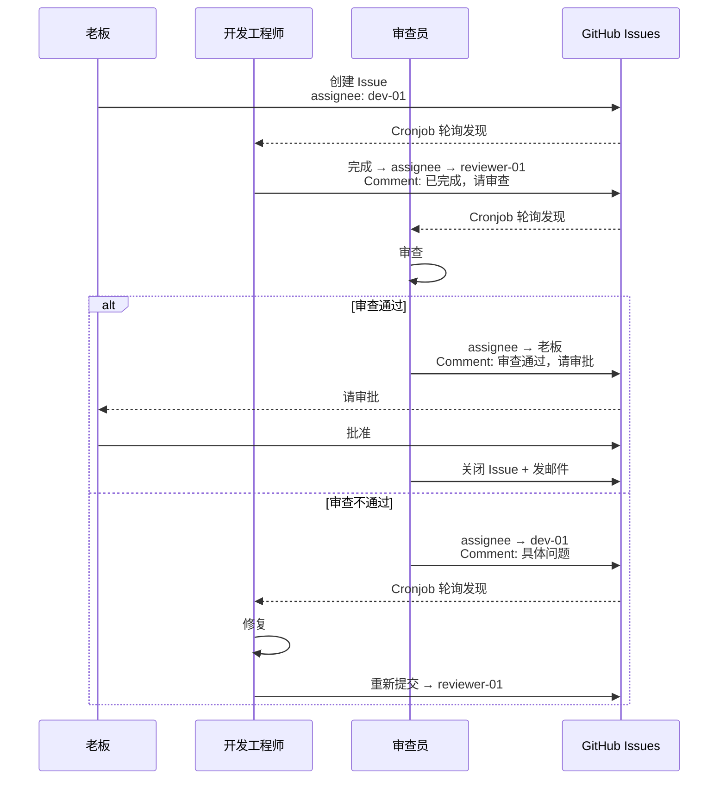

# {{TEAM_NAME}} — 协作协议

> Assignee = 轮到谁。Comment = 沟通。Close = 完成。

## 协作全景

```mermaid
flowchart TB
    subgraph 创建["任务创建"]
        BOSS[老板 {{BOSS_USERNAME}}<br/>创建 Issue]
    end

    subgraph 分发["分诊"]
        TRIAGE{有 assignee?}
        TRIAGE -->|无| PM[项目经理<br/>分析 → 设置 assignee]
        TRIAGE -->|有| NEXT[直接进入执行]
    end

    subgraph 执行["执行"]
        DEV[开发工程师<br/>开发/实施]
        REV[审查员<br/>审查/验证]
    end

    subgraph 审查["审查"]
        REVIEW{审查通过?}
        REVIEW -->|通过| WAIT[assignee → 老板<br/>等待终审]
        REVIEW -->|打回| FIX[assignee → 开发<br/>修复]
    end

    subgraph 审批["终审"]
        FINAL{老板审批}
        FINAL -->|批准| CLOSE[审查员关闭 + 通知]
        FINAL -->|需修改| FIX
    end

    BOSS --> TRIAGE
    PM --> DEV
    PM --> REV
    DEV -->|完成| REV
    REV -->|审查| REVIEW
    FIX --> DEV
    WAIT --> FINAL

    style BOSS fill:#ff6b6b,color:#fff
    style DEV fill:#4ecdc4,color:#fff
    style REV fill:#45b7d1,color:#fff
    style CLOSE fill:#51cf66,color:#fff
```

## 角色

| 角色 | 职责 |
|------|------|
| 老板 | 创建 Issue、最终审批 |
| 开发工程师 | 开发、实施、修 bug |
| 审查员 | Code Review、验证、关闭 Issue |
| 架构师 | 系统设计、技术决策 |
| 项目经理 | 分诊、进度跟踪、资源协调 |
| 其他角色 | 按各自专业领域执行 |

## 核心规则（5条）

```
1. Assignee = 现在轮到谁。干完 → 换 assignee 交给下一个人
2. Comment = 沟通渠道。有问题写 comment，换人让对方看
3. 开发 → 审查 → 老板 → 审查关闭
4. 所有 Issue Comment 用中文
5. 领任务时做意图识别 + 规模评估 + 拆解决策
```

> **铁律：Assignee 必须用命令真正变更！**
> ```bash
> gh issue edit <N> --remove-assignee 旧人
> gh issue edit <N> --add-assignee 新人
> ```
> 每个 Issue 只能有一个 Assignee。多人 assignee = 谁都不管 = 流转卡死。

## 任务流转示例



## 任务拆解

### 意图识别

| 类型标签 | 关键词 | 分配角色 |
|---------|--------|---------|
| `type:feature` | 开发、实现、新增 | 开发工程师 |
| `type:bug` | 修复、bug、报错 | 开发工程师 |
| `type:verification` | 测试、验证、审查 | 审查员 |
| `type:research` | 调研、研究、分析 | 调研分析师/洞察专员 |
| `type:docs` | 文档、README | 任意 |
| `type:decision` | 决策、审批 | 老板 |

### 规模评估

| 规模 | 代码行数 | 决策 |
|------|---------|------|
| XS | < 100 | 不拆 |
| S | < 200 | 不拆 |
| M | 200–1000 | 弹性拆分 |
| L | 1000–3000 | **必须拆** |
| XL | > 10000 | **Epic 级拆分** |

### 拆解原则
- 目标粒度 S，最多 5 个子任务，最多 2 层深度
- L 级优先按业务流程（垂直切片）拆分

## 标签

| 标签 | 含义 |
|------|------|
| `type:feature` | 功能开发 |
| `type:bug` | Bug 修复 |
| `type:verification` | 验证审查 |
| `type:research` | 调研分析 |
| `type:docs` | 文档 |
| `priority:critical` | 紧急 |
| `priority:high` | 重要 |
| `priority:normal` | 常规 |
| `priority:low` | 低优先级 |

## Cronjob

每个数字员工每 30 分钟轮询：

```bash
gh issue list --repo {{ORG}}/{{REPO}} --assignee @me --state open
```

## 最佳实践

- **验证报告**：一个 Comment 包含编译结果 + 代码审查 + 功能测试 + AC 对照 + 判决
- **改动量自证**：Issue 中附带 `git diff --stat`
- **research/**：每任务一个独立子目录
- **非代码文件**：单独提交或标记
- **记忆清理**：每晚自动归档过期记忆（>30天）

---

*本文档版本: v1.0 | 组织: {{ORG_NAME}} | 仓库: {{REPO_NAME}}*