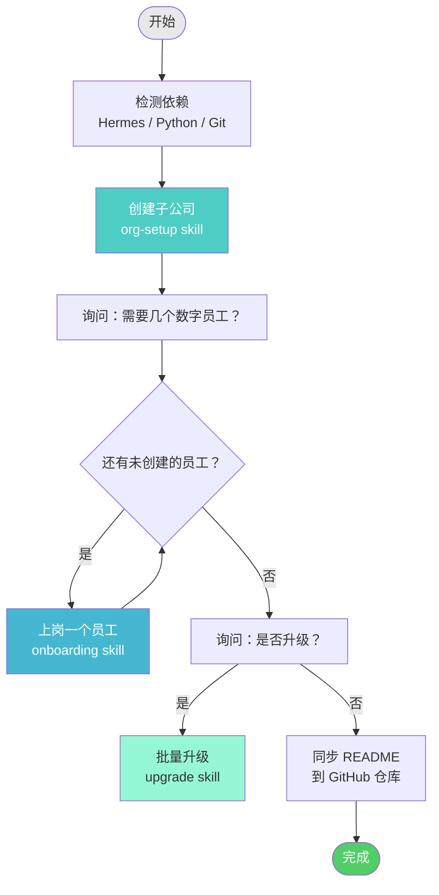
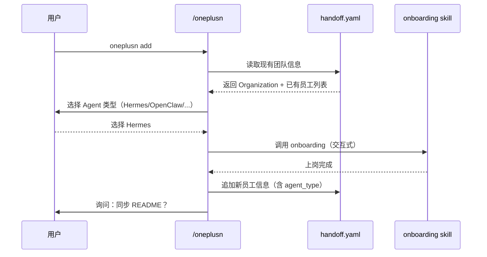
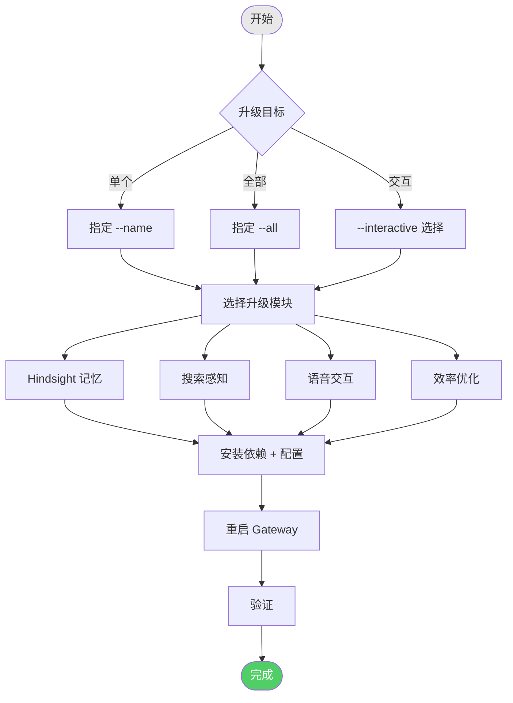
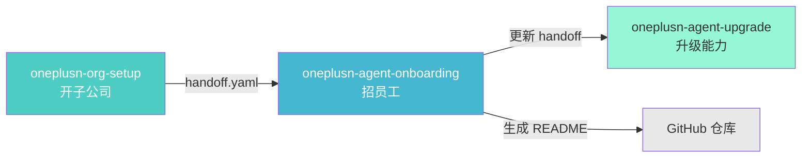

# /oneplusn — 1+N 数字员工团队管理

> 一条命令管理你的 AI 数字员工团队：开公司、招员工、升级能力、日常运维。

## 架构总览

```mermaid
graph TB
    subgraph 管理层["/oneplusn 统一入口"]
        CMD[/oneplusn]
    end

    subgraph 阶段1[Skill 1：开子公司]
        ORG[oneplusn-org-setup]
        ORG_T["创建：<br/>- 老板 GitHub<br/>- Organization<br/>- 仓库 + README"]
    end

    subgraph 阶段2[Skill 2：招员工]
        ONB[oneplusn-agent-onboarding]
        ONB_T["每次一个：<br/>- Profile + GitHub<br/>- SOUL 灵魂注入<br/>- RULES 铁律<br/>- Gateway + Cron"]
    end

    subgraph 阶段3[Skill 3：升级]
        UP[oneplusn-agent-upgrade]
        UP_T["增强能力：<br/>- Hindsight 记忆<br/>- 搜索感知<br/>- 语音交互<br/>- 效率优化"]
    end

    CMD -->|init| ORG
    CMD -->|add| ONB
    CMD -->|upgrade| UP
    CMD -->|delete / status / sync / list / edit| CMD_OPS[状态管理]

    ORG -->|handoff.yaml| ONB
    ONB -->|更新 handoff| UP
    ONB -->|生成 README| REPO[GitHub 仓库]

    style CMD fill:#ff6b6b,color:#fff,stroke:#c92a2a
    style ORG fill:#4ecdc4,color:#fff
    style ONB fill:#45b7d1,color:#fff
    style UP fill:#96f7d6,color:#333
```

## 目录结构

每个子公司独立一个工作目录：

```
{org-name}/                    # 子公司工作目录（自动创建）
├── handoff.yaml              # 团队核心配置（子公司 + 老板 + 所有员工）
├── README.md                 # 团队 README（自动同步到 GitHub）
├── rules.md                  # Agent 协作铁律（RULES）
└── agents/                   # 各数字员工的本地文件（可选）
    └── {name}/
        ├── soul.md           # 角色灵魂定义
        └── notes.txt         # 备注
```

## 8 个子命令

### `init` — 初始化整个团队

一键完成：创建子公司 + 批量招员工 + 可选升级。



```bash
./oneplusn init
# 交互式引导：创建 Organization → 输入员工数量 → 逐个配置 → 可选升级
```

---

### `add` — 添加单个数字员工



```bash
./oneplusn add --handoff oneplusn-team/handoff.yaml
```

---

### `delete` — 删除/停用数字员工

```bash
./oneplusn delete --handoff oneplusn-team/handoff.yaml --name dev-01
```

流程：
1. 从 handoff.yaml 移除员工记录
2. 可选：停用 Gateway
3. 可选：同步更新 README

---

### `status` / `list` — 查看团队状态

```bash
./oneplusn status --handoff oneplusn-team/handoff.yaml
```

输出示例：

```
============================================================
团队状态: oneplusn-team
============================================================

  名字            角色                Agent类型     端口     状态
  --------------- -----------------  -----------  -------- ----------
  dev-01          developer         hermes       8081     active
  reviewer-01     reviewer          hermes       8082     active
  pm-01           project-manager   hermes       8083     active

  总计: 3 个数字员工
============================================================
```

---

### `upgrade` — 升级数字员工



```bash
# 升级单个
./oneplusn upgrade --handoff oneplusn-team/handoff.yaml --name dev-01

# 批量升级
./oneplusn upgrade --handoff oneplusn-team/handoff.yaml --all --modules hindsight,search

# 交互式
./oneplusn upgrade --handoff oneplusn-team/handoff.yaml --interactive
```

---

### `sync` — 同步 README

根据 handoff.yaml 中的员工信息，自动生成 README.md 并提交到 GitHub。

```bash
./oneplusn sync --handoff oneplusn-team/handoff.yaml
```

---

### `edit` — 编辑员工配置

```bash
./oneplusn edit --handoff oneplusn-team/handoff.yaml --name dev-01
# 可修改：role / github_username / gateway_port / status
```

---

## 完整生命周期示例

```bash
# 1. 初始化（一键创建整个团队）
./oneplusn init
# → 创建 oneplusn-team/ 目录
# → 创建 Organization
# → 问：几个员工？ → 3
# → 逐个上岗 dev-01, reviewer-01, pm-01
# → 问：升级？ → yes → 全部 hindsight + search
# → 同步 README 到 GitHub

# 2. 查看状态
./oneplusn status --handoff oneplusn-team/handoff.yaml

# 3. 添加新员工
./oneplusn add --handoff oneplusn-team/handoff.yaml
# → 上岗 arch-01

# 4. 升级特定员工
./oneplusn upgrade --handoff oneplusn-team/handoff.yaml --name dev-01 --modules voice

# 5. 删除离职员工
./oneplusn delete --handoff oneplusn-team/handoff.yaml --name pm-01

# 6. 同步最新 README
./oneplusn sync --handoff oneplusn-team/handoff.yaml
```

## 3 个 Skill 协作关系



| Skill | 职责 | 触发命令 |
|-------|------|---------|
| `oneplusn-org-setup` | 创建子公司基础设施 | `init` |
| `oneplusn-agent-onboarding` | 逐个配置数字员工上岗 | `init` → `add` |
| `oneplusn-agent-upgrade` | 升级员工高级能力 | `init` → `upgrade` |

## Agent 类型支持

| 类型 | 状态 | handoff 字段 |
|------|------|-------------|
| Hermes Agent | ✅ 已支持 | `agent_type: hermes` |
| OpenClaw | 🔜 即将支持 | `agent_type: openclaw` |
| Claude Code | 🔜 即将支持 | `agent_type: claude-code` |
| Cursor Agent | 🔜 即将支持 | `agent_type: cursor-agent` |

## 常见问题

**Q: init 时可以选择不创建子公司吗？**
A: 可以。如果已有子公司，`init` 会检测到并复用，直接进入员工创建阶段。

**Q: 添加员工时可以选择不同 Agent 类型吗？**
A: 可以。`add` 命令会询问 Agent 类型，选择非 Hermes 会记录到 handoff，待后续支持后自动启用。

**Q: 升级是必选的吗？**
A: 不是。`init` 和 `add` 时都可选跳过升级。后续随时用 `upgrade` 命令补充。

**Q: 工作目录可以自定义吗？**
A: 默认以 Organization 名称命名（如 `oneplusn-team/`）。`init` 时会自动创建。